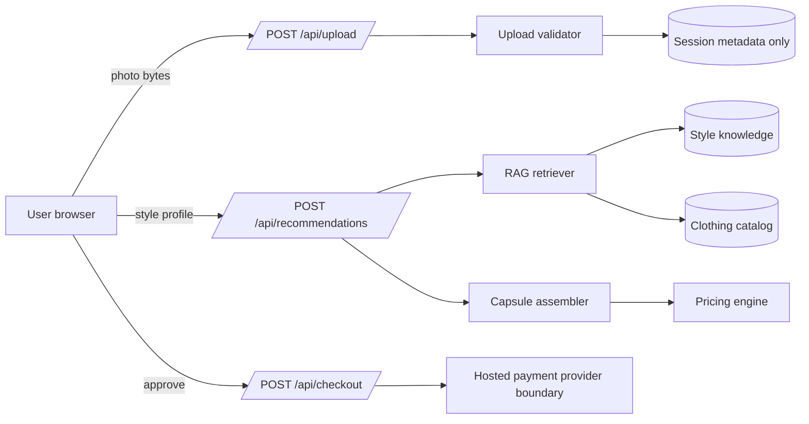

# Architecture

The app uses a dependency-light Node server so it can run from a fresh workspace. Static files live in `public`, API code lives in `server`, data lives in `data`, and tests live in `tests`.

## Request Flow

1. `GET /api/session` creates a session and returns a CSRF token.
2. `POST /api/upload` validates image bytes, records only metadata, and discards the binary.
3. `POST /api/recommendations` sanitizes profile input, retrieves style documents and catalog items, assembles a capsule, then prices it.
4. `POST /api/checkout` creates a demo order and returns a hosted-checkout-style URL.

## RAG Boundary

The retriever scores a query built from style lane, occasions, colors, fit goal, care tolerance, and budget. It searches curated style documents and catalog records. In production, the top documents would be sent to an LLM as context, separated from user instructions.
