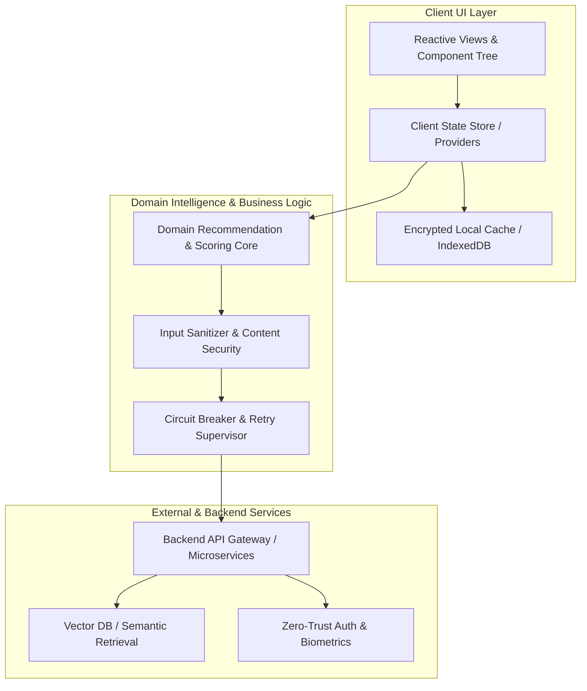
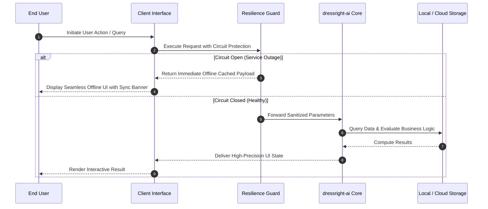
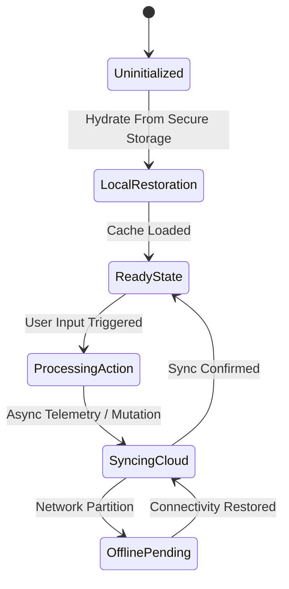

# dressright-ai: Architecture & System Topology

**Application Domain**: AI-Assisted Menswear Styling Platform with RAG Capsule Wardrobes  
**Mission**: Intelligent menswear styling advisor leveraging retrieval-augmented generation (RAG) to synthesize minimalist capsule wardrobes, color harmonies, and occasion outfits.

## 1. System Topology & Component Layout

```mermaid
flowchart TD
    subgraph ClientLayer["Client UI Layer"]
        UI["Reactive Views & Component Tree"]
        StateStore["Client State Store / Providers"]
        LocalCache["Encrypted Local Cache / IndexedDB"]
    end

    subgraph LogicLayer["Domain Intelligence & Business Logic"]
        RuleEngine["Domain Recommendation & Scoring Core"]
        SecuritySanitizer["Input Sanitizer & Content Security"]
        ResilienceGuard["Circuit Breaker & Retry Supervisor"]
    end

    subgraph ServiceLayer["External & Backend Services"]
        API["Backend API Gateway / Microservices"]
        RAG["Vector DB / Semantic Retrieval"]
        AuthService["Zero-Trust Auth & Biometrics"]
    end

    UI --> StateStore
    StateStore --> LocalCache
    StateStore --> RuleEngine
    RuleEngine --> SecuritySanitizer
    SecuritySanitizer --> ResilienceGuard
    ResilienceGuard --> API
    API --> RAG
    API --> AuthService
```

## 2. User Interaction & Data Flow Sequence

```mermaid
sequenceDiagram
    autonumber
    participant User as End User
    participant View as Client Interface
    participant Guard as Resilience Guard
    participant Engine as dressright-ai Core
    participant Store as Local / Cloud Storage

    User->>View: Initiate User Action / Query
    View->>Guard: Execute Request with Circuit Protection
    alt Circuit Open (Service Outage)
        Guard-->>View: Return Immediate Offline Cached Payload
        View-->>User: Display Seamless Offline UI with Sync Banner
    else Circuit Closed (Healthy)
        Guard->>Engine: Forward Sanitized Parameters
        Engine->>Store: Query Data & Evaluate Business Logic
        Store-->>Engine: Compute Results
        Engine-->>View: Deliver High-Precision UI State
        View-->>User: Render Interactive Result
    end
```

## 3. Application State Lifecycle

```mermaid
stateDiagram-v2
    [*] --> Uninitialized
    Uninitialized --> LocalRestoration: Hydrate From Secure Storage
    LocalRestoration --> ReadyState: Cache Loaded
    ReadyState --> ProcessingAction: User Input Triggered
    ProcessingAction --> SyncingCloud: Async Telemetry / Mutation
    SyncingCloud --> ReadyState: Sync Confirmed
    SyncingCloud --> OfflinePending: Network Partition
    OfflinePending --> SyncingCloud: Connectivity Restored
```

## 4. Key Architectural Guarantees
- **Local-First Resilience**: All critical user workflows operate with zero active internet connection, maintaining state locally until reconnect.
- **Privacy by Design**: Sensitive user context is processed on-device whenever feasible, and encrypted with authenticated AES-GCM before transport.
